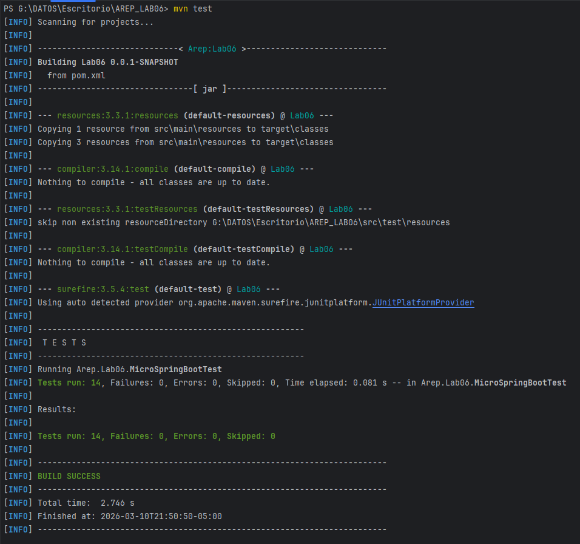
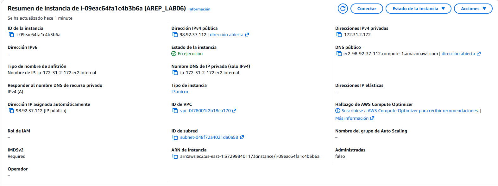
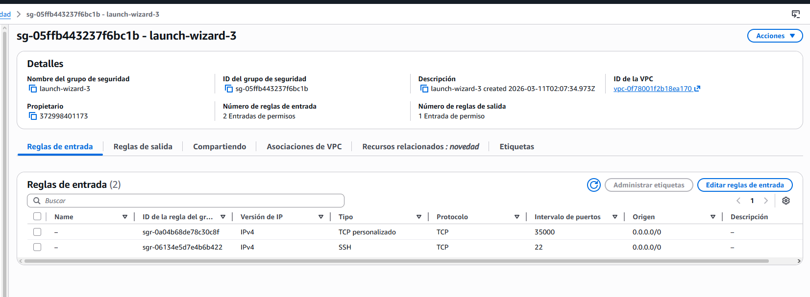
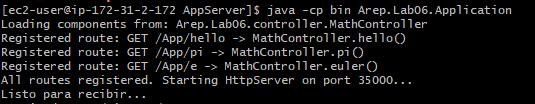
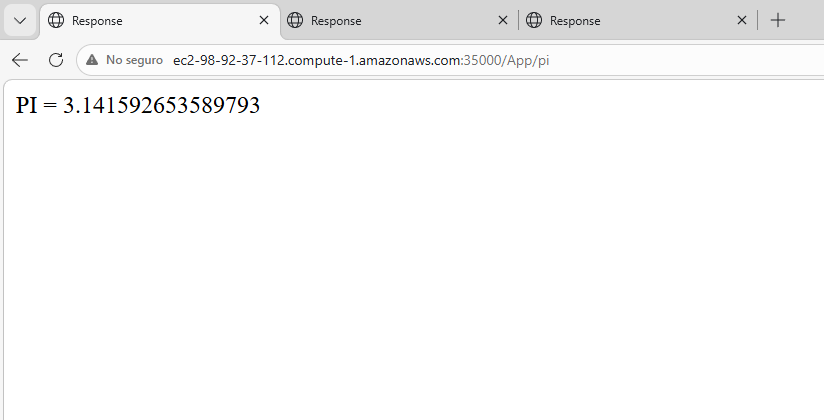
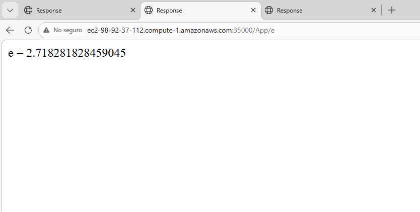
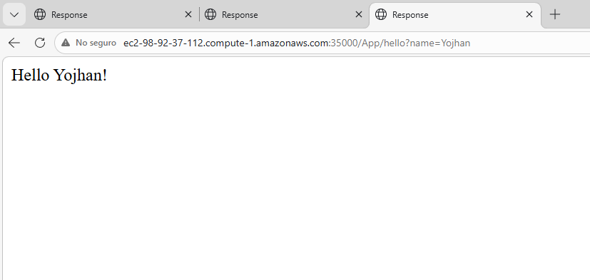

# AREP Lab06 - Framework Web IoC (MicroSpringBoot)

Framework web IoC (Inversión de Control) ligero construido en Java que imita el comportamiento principal de Spring Boot usando Reflexión de Java. El framework descubre automáticamente componentes `@RestController`, registra rutas `@GetMapping` y resuelve parámetros `@RequestParam` — todo sin dependencias externas más allá del JDK.

---

## Comenzando

Estas instrucciones te permitirán obtener una copia del proyecto en funcionamiento en tu máquina local para desarrollo y pruebas.

### Prerrequisitos

- Java 17+
- Maven 3.8+
- Git

Verifica tus instalaciones:

```bash
java -version
mvn -version
```

### Instalación

**1. Clona el repositorio**

```bash
git clone https://github.com/Yojhan-Toro/AREP_LAB06.git
cd AREP_LAB06
```

**2. Compila el proyecto**

```bash
mvn clean package
```

**3. Ejecuta la aplicación**

```bash
mvn exec:java -Dexec.mainClass="Arep.Lab06.Application"
```

O ejecuta el JAR directamente:

```bash
java -cp target/Lab06-0.0.1-SNAPSHOT.jar Arep.Lab06.Application
```

**4. Abre el navegador y prueba los endpoints**

```
http://localhost:35000/App/hello?name=Carlos
http://localhost:35000/App/pi
http://localhost:35000/App/e
```

---

## Arquitectura

El framework está compuesto por los siguientes componentes:

| Clase | Responsabilidad |
|---|---|
| `HttpServer` | Acepta conexiones TCP, parsea peticiones HTTP, sirve archivos estáticos y rutas dinámicas |
| `MicroSpringBoot` | Usa reflexión para escanear clases `@RestController` y registrar rutas `@GetMapping` |
| `HttpRequest` | Parsea la URI y extrae los parámetros de consulta |
| `HttpResponse` | Contiene los metadatos de la respuesta (código de estado, tipo de contenido) |
| `WebMethod` | Interfaz funcional que representa un manejador de ruta |
| `@RestController` | Marca una clase como componente web a ser escaneado |
| `@GetMapping` | Marca un método como manejador de ruta GET con una ruta especificada |
| `@RequestParam` | Marca un parámetro de método para ser resuelto desde la cadena de consulta |


---

## Ejecución de pruebas

Ejecuta todas las pruebas automatizadas con Maven:

```bash
mvn test
```

Salida esperada:

```
[INFO] -------------------------------------------------------
[INFO]  T E S T S
[INFO] -------------------------------------------------------
[INFO] Running Arep.Lab06.MicroSpringBootTest
[INFO] Tests run: 14, Failures: 0, Errors: 0, Skipped: 0
[INFO] -------------------------------------------------------
[INFO] BUILD SUCCESS
```

### Evidencia de pruebas




## Despliegue en AWS

La aplicación fue desplegada en una instancia EC2 de AWS 

### Creación de la maquina y configuración de seguridad 




### Ejecución en la terminal de la maquina virtual 



### Prueba de funcionamiento con DNS publico






## Construido con

- **Java 17** - Lenguaje principal
- **Maven** - Gestión de dependencias y ciclo de vida del proyecto
- **JUnit 5** - Pruebas automatizadas
- **API de Reflexión de Java** - Motor del framework IoC

---

## Autor

**Yojhan Toro Rivera**
- GitHub: [@Yojhan-Toro](https://github.com/Yojhan-Toro)

---
